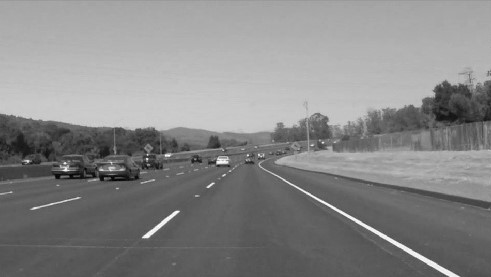
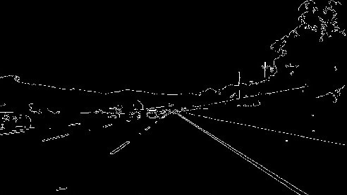
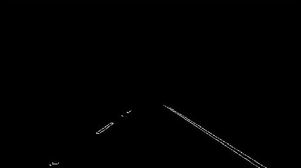

# **Finding Lane Lines on the Road** 

Overview
---

When we drive, we use our eyes to decide where to go.  The lines on the road that show us where the lanes are act as our constant reference for where to steer the vehicle.  Naturally, one of the first things we would like to do in developing a self-driving car is to automatically detect lane lines using an algorithm.

In this project you will detect lane lines in images using Python and OpenCV.  OpenCV means "Open-Source Computer Vision", which is a package that has many useful tools for analyzing images.  

To complete the project, two files will be submitted: a file containing project code and a file containing a brief write up explaining your solution. We have included template files to be used both for the [code](https://github.com/udacity/CarND-LaneLines-P1/blob/master/P1.ipynb) and the [writeup](https://github.com/udacity/CarND-LaneLines-P1/blob/master/writeup_template.md).The code file is called P1.ipynb and the writeup template is writeup_template.md 

To meet specifications in the project, take a look at the requirements in the [project rubric](https://review.udacity.com/#!/rubrics/322/view)

# **Finding Lane Lines on the Road**

The goals / steps of this project are the following:

- Make a pipeline that finds lane lines on the road
- Reflect on your work in a written report

---

### Reflection

### 1. Describe your pipeline. As part of the description, explain how you modified the draw_lines() function.

My pipeline consisted the following steps.

- Convert the iimage to grayscale.

    

- Apply Gaussian filter on the grayscaled image to reduce the noise

    

- Canny edge detection.Identify the edges where there's a large change in contrast

    

- Select the region of interest by using a mask

    

- Apply Hough transform to detect the lane line and add use red color for the detected lines

    

- Interpolate the left and right line segements into two lines. The left and right line segments are separated based on slope. The average value of the slope and intercepts are calculated to draw a single line.

    

- The above pipeline is applied to on the videos as well.
  
---

### 2. Identify potential shortcomings with your current pipeline

The current pipeline will not work in the following scenarios - 
- When there's a low contrast difference between the lane road and road
- Road turnings i.e., when the lane lines are curvy
- When the camera doesn't capture both the lines correctly

---

### 3. Suggest possible improvements to your pipeline

    - The pipeline should be able to detect the lanes even when there's a low contrast difference between the lanes and road. 
    - Deep learning techniques have to be used to interpolate the line segments

